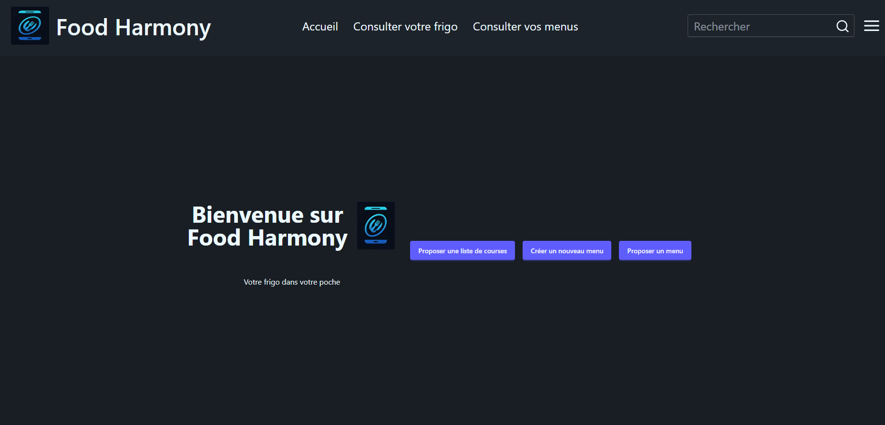

# Food-Harmony

**Food-Harmony** est une application web développée en React qui permet de gérer sa nourriture de manière simple et efficace.

## Aperçu

Voici un aperçu de l’application :



## Description

L'application a pour objectif d'aider les utilisateurs à organiser, suivre et optimiser la gestion de leurs aliments. Grâce à une interface intuitive, vous pouvez facilement :

- Ajouter et supprimer des aliments
- Visualiser l'inventaire de votre nourriture
- Ajouter et supprimer vos menus
- Visualiser l'inventaire de vos menus

## Fonctionnalités principales

- Interface utilisateur réactive grâce à React
- Gestion de l'inventaire alimentaire
- Création de vos propres menus

## Technologies utilisées

- **React** (JavaScript)
- **Flask** (Python)

## Installation

1. Clonez le dépôt :
   ```bash
   git clone https://github.com/Lucky31-tou/Food-Harmony.git
   ```

2. Installez les dépendances :
   ```bash
   cd Food-Harmony
   npm install
   ```

3. Lancez l'application :
   ```bash
   npm start
   ```

4. Rendez-vous sur [http://localhost:3000](http://localhost:3000) pour utiliser l'application.

## Auteur

- [Lucky31-tou](https://github.com/Lucky31-tou)

---

*Ce projet est open-source et en cours de développement.*
